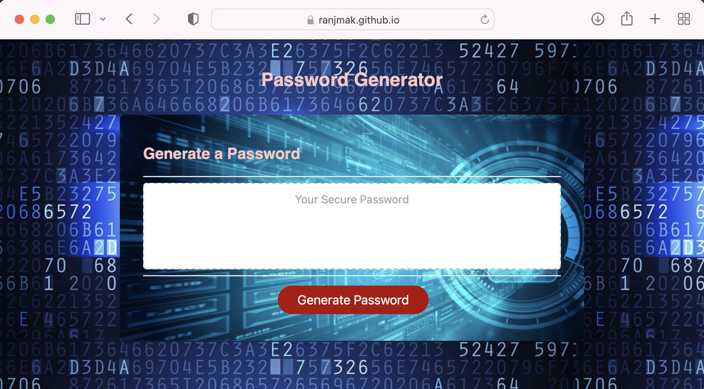

# pwd-generator
# Module 5 Challenge: Password Generator

## Overview

This week’s challenge requires the creation of an application that an employee can use to generate a random password based on criteria they’ve selected. This app will run in the browser, and will feature dynamically updated HTML and CSS powered by JavaScript code that you write. It will have a clean and polished user interface that is responsive, ensuring that it adapts to multiple screen sizes.

The password can include special characters. For more info, see this [list of Password Special Characters from the OWASP Foundation](https://www.owasp.org/index.php/Password_special_characters).

## demo
The following image shows the web application's appearance and functionality:

## website
https://ranjmak.github.io/pwd-generator/

## GitHub repo:
https://github.com/ranjmak/pwd-generator

## Instructions

* Generate a password when the button is clicked
  * Present a series of prompts with the following password criteria
    * Length of password
      * At least 10 characters but no more than 64.
    * Character types
      * Lowercase
      * Uppercase
      * Numeric
      * Special characters ($@%&*, etc)
  * Code should validate for each input and at least one character type should be selected
  * Once prompts are answered then the password should be generated and displayed in an alert or written to the page

